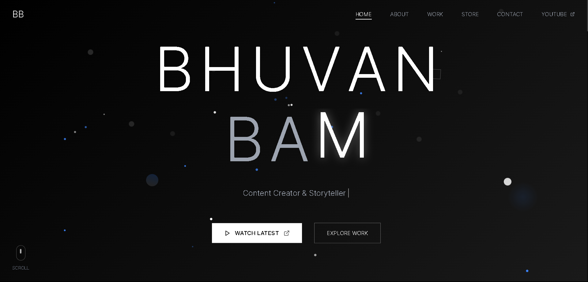
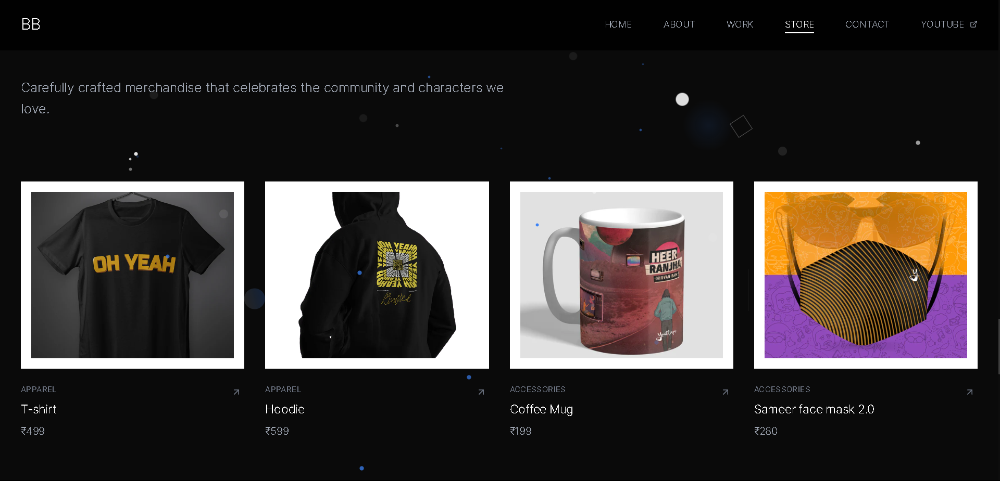
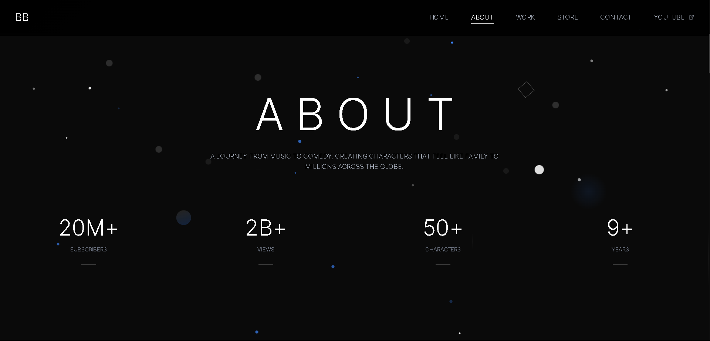

<h1 align="center">🎬 Bhuvan Bam Landing Page</h1>

## <p>An epic, animated, and fully responsive website inspired by the legendary creator <strong>Bhuvan Bam</strong>. Built using modern tech like Next.js 14, Tailwind CSS, and Framer Motion – this is not just a site, it's a vibe 💫</p>

<p align="center">
  
</p>

---

### 🚀 Live Demo
🌐 [Check it out on Vercel](https://bhuvan-bam.vercel.app/)  

---

## 🧰 Tech Stack

| Tool | Description |
|------|-------------|
| [Next.js 14](https://nextjs.org/) | React framework for building fullstack apps |
| [Tailwind CSS](https://tailwindcss.com/) | Utility-first modern CSS styling |
| [Framer Motion](https://www.framer.com/motion/) | Smooth animation library for React |
| [Lucide Icons](https://lucide.dev/) | Icon system used across UI |
| [Lenis](https://lenis.studiofreight.com/) | For buttery smooth scroll |
| PNPM | Fast and efficient package manager |

---

## ✨ Features

- ⚡ Multiple Animated Loaders (Dark, Homerun, Minimal, etc.)
- 🧲 Magnetic Buttons & Cards with hover movement
- 🎥 Interactive 3D Hero Section
- 🎨 Smooth Framer Motion transitions and scroll-linked animations
- 🛍️ Merch Section with Add-to-Cart Hover Effects
- 🧭 Scroll Progress Indicator
- 🌗 Fully responsive and mobile-ready
- 🖱️ Multiple Custom Cursors: Smooth, Playful, Homerun, Crystal
- 📬 Contact & Testimonials section included
- 🔥 Designed for performance and UX

---

## 📸 Preview Screens

### 🎯 Hero Banner


### 🛒 Merchandise Cards


### 🌌 About Screen


---

## 🛠️ Getting Started

### Step 1: Clone the Project

```bash
git clone https://github.com/your-username/bhuvan-bam-landing.git
cd bhuvan-bam-landing

pnpm install
# or
npm install

pnpm dev
# or
npm run dev
